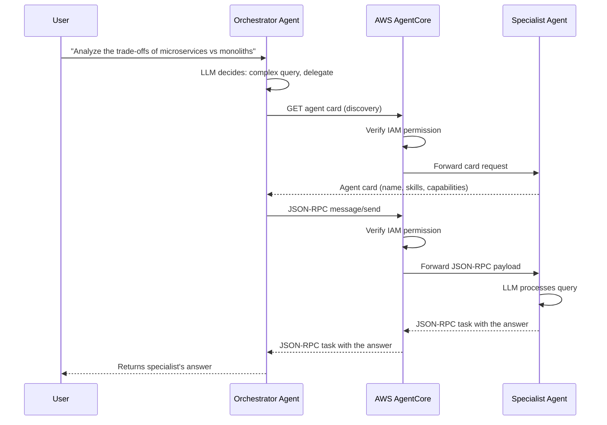
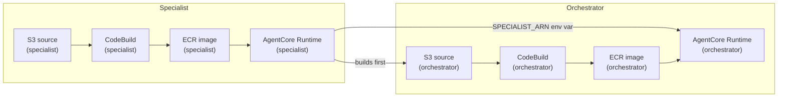

---
---
# Module 3: Multi-agent orchestration

**Duration:** ~40 minutes

## What you'll learn

- Why you'd split work across multiple agents instead of building one monolithic agent
- What the A2A (Agent-to-Agent) protocol is and how AgentCore Runtime hosts it
- How an agent card lets one agent discover another, regardless of framework
- How IAM permissions gate which agents can invoke which
- How sequential build dependencies work in Pulumi

## Glossary

New to a term? See the [Glossary](glossary.md) for every acronym used in this workshop.

## Key concepts

### The A2A protocol

A single agent with a dozen tools and a long system prompt can work, but it gets unwieldy fast. The LLM has to decide between too many options on every turn, and the system prompt becomes a wall of instructions competing for attention.

[A2A (Agent2Agent)](https://a2a-protocol.org/) is the open protocol for the alternative: agents that call other agents. An A2A server is an HTTP service that speaks JSON-RPC 2.0 and publishes an **agent card** at `/.well-known/agent-card.json` - a machine-readable description of who it is and what it can do. Any A2A client can fetch the card and start sending messages, regardless of which framework either side is built with: a Strands agent can call a LangGraph agent can call something a partner company runs.

[AgentCore Runtime hosts A2A servers natively](https://docs.aws.amazon.com/bedrock-agentcore/latest/devguide/runtime-a2a.html): set the runtime's protocol to `A2A` and your container serves JSON-RPC on port 9000 instead of the HTTP contract from Module 2. Calls still travel through the same AgentCore data plane you used before - the platform passes JSON-RPC payloads through to your container untouched - so the same IAM model applies. You need the target agent's ARN and the right permissions; AgentCore handles routing and lifecycle.

### Orchestrator/specialist pattern

The alternative to one large agent is splitting work by specialty. An **orchestrator** handles incoming requests and decides whether to answer directly or hand off to a specialist. The **specialist** has a focused system prompt and can go deep on a narrow domain.

In this module, you'll build two agents:

- **Orchestrator**: Handles simple queries (greetings, basic questions) directly. Delegates complex analytical tasks to the specialist.
- **Specialist**: An analytical agent that gives thorough, detailed answers. It doesn't know about the orchestrator - it just answers whatever it's asked.

### IAM-based access control for agent invocation

Two IAM permissions make A2A work on AgentCore: `bedrock-agentcore:GetAgentCard` (fetch the agent card during discovery) and `bedrock-agentcore:InvokeAgentRuntime` (carry the JSON-RPC messages). The orchestrator's execution role gets both; the specialist's role gets neither. This is intentional: the specialist cannot call back to the orchestrator, which prevents accidental cycles and keeps the dependency graph clear.

Every call the orchestrator makes - card fetch or message - goes through the AgentCore data plane, which verifies the caller's IAM permissions before forwarding anything to the specialist container.

### How the request flows



### Build dependency chain

Because the orchestrator needs the specialist's ARN as an environment variable, the builds must run in order: specialist first, then orchestrator.



## Step 1: Create a new Pulumi project

If you're still inside the previous module's folder, hop back to the workshop root
first (`cd -` returns to wherever you were before; adjust if needed):

```bash
cd -
```

<div class="lang-tabs" markdown="1">

<div class="lang-tab" data-lang="typescript" markdown="1">

```bash
mkdir 03-multi-agent && cd 03-multi-agent
pulumi new aws-typescript --name multi-agent --yes
```

</div>

<div class="lang-tab" data-lang="python" markdown="1">

```bash
mkdir 03-multi-agent && cd 03-multi-agent
pulumi new aws-python --name multi-agent --yes
```

</div>

</div>

Add the ESC environment reference to `Pulumi.dev.yaml`:

```bash
cat >> Pulumi.dev.yaml <<'EOF'
environment:
  - aws-bedrock-workshop/dev
EOF
```

The `pulumi new` template already includes the AWS provider. Pin it to the version this workshop uses:

<div class="lang-tabs" markdown="1">

<div class="lang-tab" data-lang="typescript" markdown="1">

```bash
npm install @pulumi/aws@7.23.0
```

</div>

<div class="lang-tab" data-lang="python" markdown="1">

The `pulumi new` template writes a `requirements.txt`. Replace it with the pinned
dependencies, then install:

```bash
cat > requirements.txt <<'EOF'
pulumi>=3.0.0,<4.0.0
pulumi-aws>=7.23.0
EOF
pulumi install
```

</div>

</div>

Set your unique stack name (replace `<id>` with the identifier you picked in Module 0):

```bash
pulumi config set stackName agentcore-multi-<id>
```

> Forgot your `<id>`? It's the 2-5 character identifier from [Module 0, Step 4](00-setup-and-orientation.md#step-4-pick-your-unique-identifier). Use the same one in every module so your resources don't collide with other participants'.

## Step 2: Write the specialist agent

The specialist is a plain Strands agent with no special tools. Its only job is to give detailed answers. What's new is how it's served: instead of `BedrockAgentCoreApp` and the `/invocations` contract from Modules 1-2, it runs as an A2A server. `StrandsA2AExecutor` adapts the agent to the protocol, and `serve_a2a` (from the `bedrock-agentcore` SDK) handles the plumbing: JSON-RPC routing on port 9000, the agent card, and the `/ping` health check AgentCore polls.

Create a folder for the specialist's source:

```bash
mkdir -p agent-specialist-code
```

Create `agent.py` inside `agent-specialist-code` and copy the content in:

```python
"""Specialist agent, served over the open A2A protocol.

Instead of the HTTP contract from Module 2 (BedrockAgentCoreApp on port 8080),
this agent is an A2A server: JSON-RPC 2.0 on port 9000, an agent card at
/.well-known/agent-card.json, and a /ping health check. Any A2A client can
discover and call it - the orchestrator is just one of them.
"""

from bedrock_agentcore.runtime.a2a import serve_a2a
from strands import Agent
from strands.multiagent.a2a import StrandsA2AExecutor

# Pin the model so every learner gets the same behavior and cost. Without an
# explicit model, Strands falls back to a default that changes between releases.
MODEL_ID = "us.anthropic.claude-haiku-4-5-20251001-v1:0"


def create_specialist_agent() -> Agent:
    """Create a specialist agent that handles specific analytical tasks"""
    system_prompt = """You are a specialist analytical agent.
    You are an expert at analyzing data and providing detailed insights.
    When asked questions, provide thorough, well-reasoned responses with specific details.
    Focus on accuracy and completeness in your answers."""

    return Agent(
        model=MODEL_ID,
        system_prompt=system_prompt,
        name="SpecialistAgent",
        description="An analytical specialist that gives thorough, detailed answers.",
    )


if __name__ == "__main__":
    # serve_a2a handles the protocol plumbing: JSON-RPC routing, the agent
    # card, and the /ping health check AgentCore polls. Bind to 0.0.0.0 so
    # the runtime can reach the server inside the container.
    serve_a2a(StrandsA2AExecutor(create_specialist_agent()), host="0.0.0.0")
```

Notice there's no entrypoint function and no payload parsing - the protocol layer does that now. The agent's `name` and `description` aren't cosmetic either: they become the agent card that clients discover.

Create `requirements.txt` inside `agent-specialist-code`. The `[a2a]` extras pull in the protocol server pieces (the `a2a-sdk`, uvicorn, starlette):

```text
strands-agents[a2a]~=1.42.0
boto3>=1.40.0
botocore>=1.40.0
bedrock-agentcore[a2a]~=1.14.0
```

Create `Dockerfile` inside `agent-specialist-code`:

```dockerfile
FROM public.ecr.aws/docker/library/python:3.11-slim
WORKDIR /app

COPY requirements.txt requirements.txt
RUN pip install -r requirements.txt
RUN pip install aws-opentelemetry-distro>=0.10.1

# Create non-root user
RUN useradd -m -u 1000 bedrock_agentcore
USER bedrock_agentcore

# The orchestrator serves HTTP on 8080; the specialist serves A2A on 9000.
EXPOSE 8080
EXPOSE 9000

COPY . .

CMD ["opentelemetry-instrument", "python", "-m", "agent"]
```

## Step 3: Write the orchestrator agent

The orchestrator itself still speaks the HTTP contract from Module 2 - you invoke it with a `{"prompt": ...}` payload like before. What changes is how it reaches the specialist. It reads `SPECIALIST_ARN` from an environment variable set by Pulumi at deploy time, turns it into the specialist's A2A endpoint URL, and hands that to `A2AClientToolProvider`. The provider fetches the specialist's agent card and exposes A2A tools to the LLM (`a2a_send_message`, `a2a_discover_agent`, ...). When the LLM decides a question is complex, it calls `a2a_send_message` - and the client library handles the JSON-RPC transport, so the three-branch response parsing you'd write by hand with boto3 disappears.

Create a folder for the orchestrator's source. If you stepped into
`agent-specialist-code` in your terminal, go back to the module root first so this
lands in the right place:

```bash
cd ..   # only if you're inside agent-specialist-code; skip if already in the module root
mkdir -p agent-orchestrator-code
```

Create `agent.py` inside `agent-orchestrator-code` and copy the content in:

```python
"""Orchestrator agent: HTTP entrypoint in front, A2A client toward the specialist.

The orchestrator itself still speaks the Module 2 HTTP contract (port 8080,
/invocations), so you invoke it exactly like before. What changed is how it
reaches the specialist: instead of a hand-rolled boto3 call, it uses an A2A
client that discovers the specialist through its agent card and talks
JSON-RPC - signed with the same IAM credentials as any AWS API call.
"""

import os

import boto3
from bedrock_agentcore.runtime import BedrockAgentCoreApp
from bedrock_agentcore.runtime.a2a import build_runtime_url
from sigv4 import SigV4HTTPXAuth
from strands import Agent
from strands_tools.a2a_client import A2AClientToolProvider

app = BedrockAgentCoreApp()

# The specialist's A2A endpoint rides the AgentCore data plane: its URL is the
# InvokeAgentRuntime endpoint with the runtime ARN encoded into the path.
# SPECIALIST_A2A_URL overrides it for local runs (e.g. http://localhost:9000).
SPECIALIST_URL = os.getenv("SPECIALIST_A2A_URL")
if not SPECIALIST_URL:
    specialist_arn = os.getenv("SPECIALIST_ARN")
    if not specialist_arn:
        raise EnvironmentError("SPECIALIST_ARN environment variable is required")
    SPECIALIST_URL = build_runtime_url(specialist_arn)

# Pin the model so every learner gets the same behavior and cost. Without an
# explicit model, Strands falls back to a default that changes between releases.
MODEL_ID = "us.anthropic.claude-haiku-4-5-20251001-v1:0"


def create_orchestrator_agent() -> Agent:
    """Create the orchestrator agent with A2A client tools for the specialist."""
    system_prompt = """You are an orchestrator agent.
    You can handle simple queries directly, but for complex analytical tasks,
    you should delegate to the specialist agent: use the a2a_send_message tool
    to send it the question (it is already discovered for you).

    Use the specialist agent when:
    - The query requires detailed analysis
    - The query is about complex topics
    - The user explicitly asks for expert analysis

    Handle simple queries (greetings, basic questions) yourself."""

    # Sign every request to the specialist with SigV4 - same IAM identity,
    # same InvokeAgentRuntime permission as a boto3 call, new protocol.
    session = boto3.Session()
    auth = SigV4HTTPXAuth(
        credentials=session.get_credentials(),
        service="bedrock-agentcore",
        region=os.getenv("AWS_REGION") or session.region_name,
    )

    # The provider fetches the specialist's agent card and exposes A2A tools
    # (a2a_send_message, a2a_discover_agent, ...) to the orchestrator.
    specialist = A2AClientToolProvider(
        known_agent_urls=[SPECIALIST_URL],
        httpx_client_args={"auth": auth},
    )

    return Agent(
        model=MODEL_ID,
        tools=specialist.tools,
        system_prompt=system_prompt,
        name="OrchestratorAgent",
    )


@app.entrypoint
async def invoke(payload=None):
    """Main entrypoint for orchestrator agent"""
    try:
        # Get the query from payload
        query = (
            payload.get("prompt", "Hello, how are you?")
            if payload
            else "Hello, how are you?"
        )

        # Create and use the orchestrator agent
        agent = create_orchestrator_agent()
        response = agent(query)

        return {
            "status": "success",
            "agent": "orchestrator",
            "response": response.message["content"][0]["text"],
        }

    except Exception as e:
        return {"status": "error", "agent": "orchestrator", "error": str(e)}


if __name__ == "__main__":
    app.run()
```

One piece is missing: the A2A client speaks plain HTTP, but AgentCore's data plane expects requests signed with AWS Signature Version 4. No SDK ships that glue yet, so the orchestrator carries a small `httpx` auth adapter based on the official AWS pattern in the [strands-agents samples](https://github.com/strands-agents/samples). Create `sigv4.py` next to `agent.py` inside `agent-orchestrator-code` and copy it as is:

```python
"""SigV4 signing for httpx, so A2A clients can call AgentCore-hosted agents.

AgentCore's data plane authenticates with AWS Signature Version 4, but
off-the-shelf A2A clients speak plain HTTP. This httpx.Auth implementation
signs each outgoing request with the caller's IAM credentials - the same
identity and permissions boto3 would use.

No SDK ships this glue yet; it follows the official AWS pattern from
github.com/strands-agents/samples (01-a2a-orchestration/utils/sigv4_auth.py).
Copy it as is.
"""

from typing import Generator

import httpx
from botocore.auth import SigV4Auth
from botocore.awsrequest import AWSRequest
from botocore.credentials import Credentials


class SigV4HTTPXAuth(httpx.Auth):
    """Sign httpx requests with AWS SigV4 for Amazon Bedrock AgentCore."""

    def __init__(self, credentials: Credentials, service: str, region: str):
        self.credentials = credentials
        self.service = service
        self.region = region

    def auth_flow(
        self, request: httpx.Request
    ) -> Generator[httpx.Request, httpx.Response, None]:
        headers = dict(request.headers)

        # AgentCore excludes the connection header from its server-side
        # signature; signing it client-side causes SignatureDoesNotMatch.
        headers.pop("connection", None)

        aws_request = AWSRequest(
            method=request.method,
            url=str(request.url),
            data=request.content,
            headers=headers,
        )

        # Freeze credentials per request so IAM role auto-refresh keeps working.
        frozen_credentials = self.credentials.get_frozen_credentials()
        SigV4Auth(frozen_credentials, self.service, self.region).add_auth(aws_request)

        request.headers.update(dict(aws_request.headers))
        yield request
```

Create `requirements.txt` inside `agent-orchestrator-code`. The orchestrator consumes A2A rather than serving it, so its extra is `[a2a-client]` on the tools package:

```text
strands-agents~=1.42.0
strands-agents-tools[a2a-client]~=0.8.0
boto3>=1.40.0
botocore>=1.40.0
bedrock-agentcore[a2a]~=1.14.0
```

The orchestrator uses the same `Dockerfile` as the specialist - copy it into `agent-orchestrator-code/`.

## Step 4: Create the buildspecs

Each agent has its own CodeBuild buildspec. Both follow the same pattern: authenticate to ECR, build the Docker image for ARM64, and push it. Both files live in the **module root** (next to the two `agent-*-code` folders), where the Pulumi program reads them.

Create `buildspec-specialist.yml` in the module root:

```yaml
version: 0.2

phases:
  pre_build:
    commands:
      - echo Source code already extracted by CodeBuild
      - cd $CODEBUILD_SRC_DIR
      - echo Logging in to Amazon ECR
      - aws ecr get-login-password --region $AWS_DEFAULT_REGION | docker login --username AWS --password-stdin $AWS_ACCOUNT_ID.dkr.ecr.$AWS_DEFAULT_REGION.amazonaws.com

  build:
    commands:
      - echo Build started on `date`
      - echo Building the Docker image for Specialist Agent ARM64
      - docker build -t $IMAGE_REPO_NAME:$IMAGE_TAG .
      - docker tag $IMAGE_REPO_NAME:$IMAGE_TAG $AWS_ACCOUNT_ID.dkr.ecr.$AWS_DEFAULT_REGION.amazonaws.com/$IMAGE_REPO_NAME:$IMAGE_TAG

  post_build:
    commands:
      - echo Build completed on `date`
      - echo Pushing the Specialist Docker image
      - docker push $AWS_ACCOUNT_ID.dkr.ecr.$AWS_DEFAULT_REGION.amazonaws.com/$IMAGE_REPO_NAME:$IMAGE_TAG
      - echo Specialist Agent ARM64 Docker image pushed successfully
```

Create `buildspec-orchestrator.yml`, also in the module root:

```yaml
version: 0.2

phases:
  pre_build:
    commands:
      - echo Source code already extracted by CodeBuild
      - cd $CODEBUILD_SRC_DIR
      - echo Logging in to Amazon ECR
      - aws ecr get-login-password --region $AWS_DEFAULT_REGION | docker login --username AWS --password-stdin $AWS_ACCOUNT_ID.dkr.ecr.$AWS_DEFAULT_REGION.amazonaws.com

  build:
    commands:
      - echo Build started on `date`
      - echo Building the Docker image for Orchestrator Agent ARM64
      - docker build -t $IMAGE_REPO_NAME:$IMAGE_TAG .
      - docker tag $IMAGE_REPO_NAME:$IMAGE_TAG $AWS_ACCOUNT_ID.dkr.ecr.$AWS_DEFAULT_REGION.amazonaws.com/$IMAGE_REPO_NAME:$IMAGE_TAG

  post_build:
    commands:
      - echo Build completed on `date`
      - echo Pushing the Orchestrator Docker image
      - docker push $AWS_ACCOUNT_ID.dkr.ecr.$AWS_DEFAULT_REGION.amazonaws.com/$IMAGE_REPO_NAME:$IMAGE_TAG
      - echo Orchestrator Agent ARM64 Docker image pushed successfully
```

## Step 5: Create the build trigger Lambda

Module 2 shipped a ZIP straight to AgentCore. This module deploys **container
images** instead, which is the other way to run an agent on AgentCore - so it needs
CodeBuild to run the Docker build and a small Lambda to drive it. The Lambda starts a
CodeBuild job and polls until the build finishes, then returns, so Pulumi waits for
the image to be ready before it creates the runtime.

From the module root, create the Lambda folder:

```bash
mkdir -p lambda/build-trigger
```

Create `index.py` inside `lambda/build-trigger` and copy the content in:

```python
import json
import logging
import time

import boto3


LOGGER = logging.getLogger()
LOGGER.setLevel(logging.INFO)


def handler(event, _context):
    LOGGER.info("Received event: %s", json.dumps(event))

    project_name = event["projectName"]
    region = event.get("region")
    poll_interval_seconds = int(event.get("pollIntervalSeconds", 15))

    codebuild = boto3.client("codebuild", region_name=region)
    response = codebuild.start_build(projectName=project_name)
    build_id = response["build"]["id"]
    LOGGER.info("Started build %s for project %s", build_id, project_name)

    while True:
        build_response = codebuild.batch_get_builds(ids=[build_id])
        build = build_response["builds"][0]
        status = build["buildStatus"]

        if status == "SUCCEEDED":
            LOGGER.info("Build %s succeeded", build_id)
            return {
                "buildId": build_id,
                "status": status,
                "imageDigest": build.get("resolvedSourceVersion"),
            }

        if status in {"FAILED", "FAULT", "STOPPED", "TIMED_OUT"}:
            LOGGER.error("Build %s failed with status %s", build_id, status)
            raise RuntimeError(f"CodeBuild {build_id} failed with status {status}")

        LOGGER.info("Build %s status: %s", build_id, status)
        time.sleep(poll_interval_seconds)
```

## Step 6: Write the Pulumi infrastructure

Because we're deploying two agents, the infrastructure is doubled: two S3 buckets, two ECR repos, two IAM roles, two CodeBuild projects, two Lambda invocations, and two AgentCore Runtimes.

We'll build this up section by section. Delete the starter code that `pulumi new`
put in `index.ts` (TypeScript) or `__main__.py` (Python), then paste the sections
below into that file in order.

### Configuration and data sources

<details>
<summary><strong>Want to know more?</strong> - Pulumi Registry</summary>
<p><a href="https://www.pulumi.com/docs/concepts/config/">pulumi.Config</a></p>
</details>

Start with configuration values and the AWS account/region data sources. The `stackName` config value is used as a prefix for every resource name so multiple stacks don't collide.

<div class="lang-tabs" markdown="1">

<div class="lang-tab" data-lang="typescript" markdown="1">

```typescript
import * as pulumi from "@pulumi/pulumi";
import * as aws from "@pulumi/aws";
import { createHash } from "crypto";
import * as fs from "fs";
import * as path from "path";

const config = new pulumi.Config();
const orchestratorName = config.get("orchestratorName") || "OrchestratorAgent";
const specialistName = config.get("specialistName") || "SpecialistAgent";
const networkMode = config.get("networkMode") || "PUBLIC";
const imageTag = config.get("imageTag") || "latest";
const stackName = config.get("stackName") || "agentcore-multi-agent";
const ecrRepositoryName = config.get("ecrRepositoryName") || "multi-agent";

const awsConfig = new pulumi.Config("aws");
const awsRegion = awsConfig.require("region");

const currentIdentity = aws.getCallerIdentityOutput({});
const currentRegion = aws.getRegionOutput({});
```

</div>

<div class="lang-tab" data-lang="python" markdown="1">

```python
import hashlib
import json
import os

import pulumi
import pulumi_aws as aws

config = pulumi.Config()
orchestrator_name = config.get("orchestratorName") or "OrchestratorAgent"
specialist_name = config.get("specialistName") or "SpecialistAgent"
network_mode = config.get("networkMode") or "PUBLIC"
image_tag = config.get("imageTag") or "latest"
stack_name = config.get("stackName") or "agentcore-multi-agent"
ecr_repository_name = config.get("ecrRepositoryName") or "multi-agent"

aws_config = pulumi.Config("aws")
aws_region = aws_config.require("region")

current_identity = aws.get_caller_identity_output()
current_region = aws.get_region_output()
```

</div>

</div>

### Dual S3 buckets

<details>
<summary><strong>Want to know more?</strong> - Pulumi Registry</summary>
<p><a href="https://www.pulumi.com/registry/packages/aws/api-docs/s3/bucket/">aws.s3.Bucket</a></p>
</details>

Each agent gets its own S3 bucket to store its source code archive. Keeping them separate makes it easy to trigger only the affected build when a single agent changes.

<div class="lang-tabs" markdown="1">

<div class="lang-tab" data-lang="typescript" markdown="1">

```typescript
const orchestratorSourceBucket = new aws.s3.Bucket("orchestrator_source", {
  bucketPrefix: `${stackName}-orch-src-`,
  forceDestroy: true,
  tags: {
    Name: `${stackName}-orchestrator-source`,
    Purpose: "Store Orchestrator agent source code for CodeBuild",
  },
});

const specialistSourceBucket = new aws.s3.Bucket("specialist_source", {
  bucketPrefix: `${stackName}-spec-src-`,
  forceDestroy: true,
  tags: {
    Name: `${stackName}-specialist-source`,
    Purpose: "Store Specialist agent source code for CodeBuild",
  },
});

new aws.s3.BucketPublicAccessBlock("orchestrator_source", {
  bucket: orchestratorSourceBucket.id,
  blockPublicAcls: true,
  blockPublicPolicy: true,
  ignorePublicAcls: true,
  restrictPublicBuckets: true,
});

new aws.s3.BucketPublicAccessBlock("specialist_source", {
  bucket: specialistSourceBucket.id,
  blockPublicAcls: true,
  blockPublicPolicy: true,
  ignorePublicAcls: true,
  restrictPublicBuckets: true,
});

new aws.s3.BucketVersioning("orchestrator_source", {
  bucket: orchestratorSourceBucket.id,
  versioningConfiguration: {
    status: "Enabled",
  },
});

new aws.s3.BucketVersioning("specialist_source", {
  bucket: specialistSourceBucket.id,
  versioningConfiguration: {
    status: "Enabled",
  },
});
```

</div>

<div class="lang-tab" data-lang="python" markdown="1">

```python
orchestrator_source_bucket = aws.s3.Bucket(
    "orchestrator_source",
    bucket_prefix=f"{stack_name}-orch-src-",
    force_destroy=True,
    tags={
        "Name": f"{stack_name}-orchestrator-source",
        "Purpose": "Store Orchestrator agent source code for CodeBuild",
    },
)

specialist_source_bucket = aws.s3.Bucket(
    "specialist_source",
    bucket_prefix=f"{stack_name}-spec-src-",
    force_destroy=True,
    tags={
        "Name": f"{stack_name}-specialist-source",
        "Purpose": "Store Specialist agent source code for CodeBuild",
    },
)

aws.s3.BucketPublicAccessBlock(
    "orchestrator_source",
    bucket=orchestrator_source_bucket.id,
    block_public_acls=True,
    block_public_policy=True,
    ignore_public_acls=True,
    restrict_public_buckets=True,
)

aws.s3.BucketPublicAccessBlock(
    "specialist_source",
    bucket=specialist_source_bucket.id,
    block_public_acls=True,
    block_public_policy=True,
    ignore_public_acls=True,
    restrict_public_buckets=True,
)

aws.s3.BucketVersioning(
    "orchestrator_source",
    bucket=orchestrator_source_bucket.id,
    versioning_configuration={"status": "Enabled"},
)

aws.s3.BucketVersioning(
    "specialist_source",
    bucket=specialist_source_bucket.id,
    versioning_configuration={"status": "Enabled"},
)
```

</div>

</div>

### Upload source code to S3

Pulumi zips the local agent directories and uploads them to S3. The `versionId` output of each object is used later as a trigger to detect when the source changes and a rebuild is needed.

<div class="lang-tabs" markdown="1">

<div class="lang-tab" data-lang="typescript" markdown="1">

```typescript
const orchestratorSourceObject = new aws.s3.BucketObjectv2(
  "orchestrator_source",
  {
    bucket: orchestratorSourceBucket.id,
    key: "agent-orchestrator-code.zip",
    source: new pulumi.asset.FileArchive(
      path.resolve(__dirname, "agent-orchestrator-code"),
    ),
    tags: {
      Name: "agent-orchestrator-source-code",
    },
  },
);

const specialistSourceObject = new aws.s3.BucketObjectv2("specialist_source", {
  bucket: specialistSourceBucket.id,
  key: "agent-specialist-code.zip",
  source: new pulumi.asset.FileArchive(
    path.resolve(__dirname, "agent-specialist-code"),
  ),
  tags: {
    Name: "agent-specialist-source-code",
  },
});
```

</div>

<div class="lang-tab" data-lang="python" markdown="1">

```python
orchestrator_source_object = aws.s3.BucketObjectv2(
    "orchestrator_source",
    bucket=orchestrator_source_bucket.id,
    key="agent-orchestrator-code.zip",
    source=pulumi.FileArchive(
        os.path.join(os.path.dirname(__file__), "agent-orchestrator-code")
    ),
    tags={"Name": "agent-orchestrator-source-code"},
)

specialist_source_object = aws.s3.BucketObjectv2(
    "specialist_source",
    bucket=specialist_source_bucket.id,
    key="agent-specialist-code.zip",
    source=pulumi.FileArchive(
        os.path.join(os.path.dirname(__file__), "agent-specialist-code")
    ),
    tags={"Name": "agent-specialist-source-code"},
)
```

</div>

</div>

### Dual ECR repositories

<details>
<summary><strong>Want to know more?</strong> - Pulumi Registry</summary>
<p><a href="https://www.pulumi.com/registry/packages/aws/api-docs/ecr/repository/">aws.ecr.Repository</a></p>
</details>

Each agent image lives in its own ECR repository. The lifecycle policy keeps storage costs down by expiring old images beyond the last 5.

<div class="lang-tabs" markdown="1">

<div class="lang-tab" data-lang="typescript" markdown="1">

```typescript
const orchestratorEcr = new aws.ecr.Repository("orchestrator", {
  name: `${stackName}-${ecrRepositoryName}-orchestrator`,
  imageTagMutability: "MUTABLE",
  imageScanningConfiguration: {
    scanOnPush: true,
  },
  forceDelete: true,
  tags: {
    Name: `${stackName}-orchestrator-ecr-repository`,
    Module: "ECR",
  },
});

const specialistEcr = new aws.ecr.Repository("specialist", {
  name: `${stackName}-${ecrRepositoryName}-specialist`,
  imageTagMutability: "MUTABLE",
  imageScanningConfiguration: {
    scanOnPush: true,
  },
  forceDelete: true,
  tags: {
    Name: `${stackName}-specialist-ecr-repository`,
    Module: "ECR",
  },
});

new aws.ecr.RepositoryPolicy("orchestrator", {
  repository: orchestratorEcr.name,
  policy: pulumi.jsonStringify({
    Version: "2012-10-17",
    Statement: [
      {
        Sid: "AllowPullFromAccount",
        Effect: "Allow",
        Principal: {
          AWS: currentIdentity.apply(
            (id) => `arn:aws:iam::${id.accountId}:root`,
          ),
        },
        Action: ["ecr:BatchGetImage", "ecr:GetDownloadUrlForLayer"],
      },
    ],
  }),
});

new aws.ecr.RepositoryPolicy("specialist", {
  repository: specialistEcr.name,
  policy: pulumi.jsonStringify({
    Version: "2012-10-17",
    Statement: [
      {
        Sid: "AllowPullFromAccount",
        Effect: "Allow",
        Principal: {
          AWS: currentIdentity.apply(
            (id) => `arn:aws:iam::${id.accountId}:root`,
          ),
        },
        Action: ["ecr:BatchGetImage", "ecr:GetDownloadUrlForLayer"],
      },
    ],
  }),
});

new aws.ecr.LifecyclePolicy("orchestrator", {
  repository: orchestratorEcr.name,
  policy: JSON.stringify({
    rules: [
      {
        rulePriority: 1,
        description: "Keep last 5 images",
        selection: {
          tagStatus: "any",
          countType: "imageCountMoreThan",
          countNumber: 5,
        },
        action: {
          type: "expire",
        },
      },
    ],
  }),
});

new aws.ecr.LifecyclePolicy("specialist", {
  repository: specialistEcr.name,
  policy: JSON.stringify({
    rules: [
      {
        rulePriority: 1,
        description: "Keep last 5 images",
        selection: {
          tagStatus: "any",
          countType: "imageCountMoreThan",
          countNumber: 5,
        },
        action: {
          type: "expire",
        },
      },
    ],
  }),
});
```

</div>

<div class="lang-tab" data-lang="python" markdown="1">

```python
orchestrator_ecr = aws.ecr.Repository(
    "orchestrator",
    name=f"{stack_name}-{ecr_repository_name}-orchestrator",
    image_tag_mutability="MUTABLE",
    image_scanning_configuration={"scan_on_push": True},
    force_delete=True,
    tags={
        "Name": f"{stack_name}-orchestrator-ecr-repository",
        "Module": "ECR",
    },
)

specialist_ecr = aws.ecr.Repository(
    "specialist",
    name=f"{stack_name}-{ecr_repository_name}-specialist",
    image_tag_mutability="MUTABLE",
    image_scanning_configuration={"scan_on_push": True},
    force_delete=True,
    tags={
        "Name": f"{stack_name}-specialist-ecr-repository",
        "Module": "ECR",
    },
)

aws.ecr.RepositoryPolicy(
    "orchestrator",
    repository=orchestrator_ecr.name,
    policy=pulumi.Output.json_dumps(
        {
            "Version": "2012-10-17",
            "Statement": [
                {
                    "Sid": "AllowPullFromAccount",
                    "Effect": "Allow",
                    "Principal": {
                        "AWS": current_identity.apply(
                            lambda id: f"arn:aws:iam::{id.account_id}:root"
                        ),
                    },
                    "Action": ["ecr:BatchGetImage", "ecr:GetDownloadUrlForLayer"],
                }
            ],
        }
    ),
)

aws.ecr.RepositoryPolicy(
    "specialist",
    repository=specialist_ecr.name,
    policy=pulumi.Output.json_dumps(
        {
            "Version": "2012-10-17",
            "Statement": [
                {
                    "Sid": "AllowPullFromAccount",
                    "Effect": "Allow",
                    "Principal": {
                        "AWS": current_identity.apply(
                            lambda id: f"arn:aws:iam::{id.account_id}:root"
                        ),
                    },
                    "Action": ["ecr:BatchGetImage", "ecr:GetDownloadUrlForLayer"],
                }
            ],
        }
    ),
)

aws.ecr.LifecyclePolicy(
    "orchestrator",
    repository=orchestrator_ecr.name,
    policy=json.dumps(
        {
            "rules": [
                {
                    "rulePriority": 1,
                    "description": "Keep last 5 images",
                    "selection": {
                        "tagStatus": "any",
                        "countType": "imageCountMoreThan",
                        "countNumber": 5,
                    },
                    "action": {"type": "expire"},
                }
            ]
        }
    ),
)

aws.ecr.LifecyclePolicy(
    "specialist",
    repository=specialist_ecr.name,
    policy=json.dumps(
        {
            "rules": [
                {
                    "rulePriority": 1,
                    "description": "Keep last 5 images",
                    "selection": {
                        "tagStatus": "any",
                        "countType": "imageCountMoreThan",
                        "countNumber": 5,
                    },
                    "action": {"type": "expire"},
                }
            ]
        }
    ),
)
```

</div>

</div>

### Orchestrator execution role

<details>
<summary><strong>Want to know more?</strong> - Pulumi Registry</summary>
<p><a href="https://www.pulumi.com/registry/packages/aws/api-docs/iam/role/">aws.iam.Role</a> &middot; <a href="https://www.pulumi.com/registry/packages/aws/api-docs/iam/rolepolicyattachment/">aws.iam.RolePolicyAttachment</a> &middot; <a href="https://www.pulumi.com/registry/packages/aws/api-docs/iam/rolepolicy/">aws.iam.RolePolicy</a></p>
</details>

The orchestrator execution role is the IAM identity that AgentCore uses when running the orchestrator container. The trust policy restricts assumption to `bedrock-agentcore.amazonaws.com` with source account and ARN conditions to prevent confused deputy attacks. The inline policy grants the permissions the container needs: ECR image pull, CloudWatch logging, X-Ray tracing, Bedrock model invocation, and the workload access token APIs.

One thing these roles deliberately do *not* get: the broad `BedrockAgentCoreFullAccess` managed policy that Module 2 attached as a convenience. That policy allows `bedrock-agentcore:*`, which includes `InvokeAgentRuntime` - attach it to both agents and each one can invoke the other, and the one-way boundary this module is built around is gone. A role's effective permissions are the union of everything attached to it, so every grant here stays explicit.

<div class="lang-tabs" markdown="1">

<div class="lang-tab" data-lang="typescript" markdown="1">

```typescript
const orchestratorExecution = new aws.iam.Role("orchestrator_execution", {
  name: `${stackName}-orchestrator-execution-role`,
  assumeRolePolicy: pulumi.jsonStringify({
    Version: "2012-10-17",
    Statement: [
      {
        Sid: "AssumeRolePolicy",
        Effect: "Allow",
        Principal: {
          Service: "bedrock-agentcore.amazonaws.com",
        },
        Action: "sts:AssumeRole",
        Condition: {
          StringEquals: {
            "aws:SourceAccount": currentIdentity.apply((id) => id.accountId),
          },
          ArnLike: {
            "aws:SourceArn": pulumi
              .all([currentRegion, currentIdentity])
              .apply(
                ([region, identity]) =>
                  `arn:aws:bedrock-agentcore:${region.region}:${identity.accountId}:*`,
              ),
          },
        },
      },
    ],
  }),
  tags: {
    Name: `${stackName}-orchestrator-execution-role`,
    Module: "IAM",
  },
});

const orchestratorExecutionRolePolicy = new aws.iam.RolePolicy(
  "orchestrator_execution",
  {
    name: "OrchestratorCoreExecutionPolicy",
    role: orchestratorExecution.id,
    policy: pulumi.jsonStringify({
      Version: "2012-10-17",
      Statement: [
        {
          Sid: "ECRImageAccess",
          Effect: "Allow",
          Action: [
            "ecr:BatchGetImage",
            "ecr:GetDownloadUrlForLayer",
            "ecr:BatchCheckLayerAvailability",
          ],
          Resource: orchestratorEcr.arn,
        },
        {
          Sid: "ECRTokenAccess",
          Effect: "Allow",
          Action: ["ecr:GetAuthorizationToken"],
          Resource: "*",
        },
        {
          Sid: "CloudWatchLogs",
          Effect: "Allow",
          Action: [
            "logs:DescribeLogStreams",
            "logs:CreateLogGroup",
            "logs:DescribeLogGroups",
            "logs:CreateLogStream",
            "logs:PutLogEvents",
          ],
          Resource: pulumi
            .all([currentRegion, currentIdentity])
            .apply(
              ([region, identity]) =>
                `arn:aws:logs:${region.region}:${identity.accountId}:log-group:/aws/bedrock-agentcore/runtimes/*`,
            ),
        },
        {
          Sid: "XRayTracing",
          Effect: "Allow",
          Action: [
            "xray:PutTraceSegments",
            "xray:PutTelemetryRecords",
            "xray:GetSamplingRules",
            "xray:GetSamplingTargets",
          ],
          Resource: "*",
        },
        {
          Sid: "CloudWatchMetrics",
          Effect: "Allow",
          Action: ["cloudwatch:PutMetricData"],
          Resource: "*",
          Condition: {
            StringEquals: {
              "cloudwatch:namespace": "bedrock-agentcore",
            },
          },
        },
        {
          Sid: "BedrockModelInvocation",
          Effect: "Allow",
          Action: [
            "bedrock:InvokeModel",
            "bedrock:InvokeModelWithResponseStream",
          ],
          Resource: "*",
        },
        {
          Sid: "GetAgentAccessToken",
          Effect: "Allow",
          Action: [
            "bedrock-agentcore:GetWorkloadAccessToken",
            "bedrock-agentcore:GetWorkloadAccessTokenForJWT",
            "bedrock-agentcore:GetWorkloadAccessTokenForUserId",
          ],
          Resource: [
            pulumi
              .all([currentRegion, currentIdentity])
              .apply(
                ([region, identity]) =>
                  `arn:aws:bedrock-agentcore:${region.region}:${identity.accountId}:workload-identity-directory/default`,
              ),
            pulumi
              .all([currentRegion, currentIdentity])
              .apply(
                ([region, identity]) =>
                  `arn:aws:bedrock-agentcore:${region.region}:${identity.accountId}:workload-identity-directory/default/workload-identity/*`,
              ),
          ],
        },
      ],
    }),
  },
);
```

</div>

<div class="lang-tab" data-lang="python" markdown="1">

```python
orchestrator_execution = aws.iam.Role(
    "orchestrator_execution",
    name=f"{stack_name}-orchestrator-execution-role",
    assume_role_policy=pulumi.Output.json_dumps(
        {
            "Version": "2012-10-17",
            "Statement": [
                {
                    "Sid": "AssumeRolePolicy",
                    "Effect": "Allow",
                    "Principal": {"Service": "bedrock-agentcore.amazonaws.com"},
                    "Action": "sts:AssumeRole",
                    "Condition": {
                        "StringEquals": {
                            "aws:SourceAccount": current_identity.apply(
                                lambda id: id.account_id
                            ),
                        },
                        "ArnLike": {
                            "aws:SourceArn": pulumi.Output.all(
                                current_region, current_identity
                            ).apply(
                                lambda args: f"arn:aws:bedrock-agentcore:{args[0].region}:{args[1].account_id}:*"
                            ),
                        },
                    },
                }
            ],
        }
    ),
    tags={
        "Name": f"{stack_name}-orchestrator-execution-role",
        "Module": "IAM",
    },
)

orchestrator_execution_role_policy = aws.iam.RolePolicy(
    "orchestrator_execution",
    name="OrchestratorCoreExecutionPolicy",
    role=orchestrator_execution.id,
    policy=pulumi.Output.json_dumps(
        {
            "Version": "2012-10-17",
            "Statement": [
                {
                    "Sid": "ECRImageAccess",
                    "Effect": "Allow",
                    "Action": [
                        "ecr:BatchGetImage",
                        "ecr:GetDownloadUrlForLayer",
                        "ecr:BatchCheckLayerAvailability",
                    ],
                    "Resource": orchestrator_ecr.arn,
                },
                {
                    "Sid": "ECRTokenAccess",
                    "Effect": "Allow",
                    "Action": ["ecr:GetAuthorizationToken"],
                    "Resource": "*",
                },
                {
                    "Sid": "CloudWatchLogs",
                    "Effect": "Allow",
                    "Action": [
                        "logs:DescribeLogStreams",
                        "logs:CreateLogGroup",
                        "logs:DescribeLogGroups",
                        "logs:CreateLogStream",
                        "logs:PutLogEvents",
                    ],
                    "Resource": pulumi.Output.all(
                        current_region, current_identity
                    ).apply(
                        lambda args: f"arn:aws:logs:{args[0].region}:{args[1].account_id}:log-group:/aws/bedrock-agentcore/runtimes/*"
                    ),
                },
                {
                    "Sid": "XRayTracing",
                    "Effect": "Allow",
                    "Action": [
                        "xray:PutTraceSegments",
                        "xray:PutTelemetryRecords",
                        "xray:GetSamplingRules",
                        "xray:GetSamplingTargets",
                    ],
                    "Resource": "*",
                },
                {
                    "Sid": "CloudWatchMetrics",
                    "Effect": "Allow",
                    "Action": ["cloudwatch:PutMetricData"],
                    "Resource": "*",
                    "Condition": {
                        "StringEquals": {"cloudwatch:namespace": "bedrock-agentcore"}
                    },
                },
                {
                    "Sid": "BedrockModelInvocation",
                    "Effect": "Allow",
                    "Action": [
                        "bedrock:InvokeModel",
                        "bedrock:InvokeModelWithResponseStream",
                    ],
                    "Resource": "*",
                },
                {
                    "Sid": "GetAgentAccessToken",
                    "Effect": "Allow",
                    "Action": [
                        "bedrock-agentcore:GetWorkloadAccessToken",
                        "bedrock-agentcore:GetWorkloadAccessTokenForJWT",
                        "bedrock-agentcore:GetWorkloadAccessTokenForUserId",
                    ],
                    "Resource": [
                        pulumi.Output.all(current_region, current_identity).apply(
                            lambda args: f"arn:aws:bedrock-agentcore:{args[0].region}:{args[1].account_id}:workload-identity-directory/default"
                        ),
                        pulumi.Output.all(current_region, current_identity).apply(
                            lambda args: f"arn:aws:bedrock-agentcore:{args[0].region}:{args[1].account_id}:workload-identity-directory/default/workload-identity/*"
                        ),
                    ],
                },
            ],
        }
    ),
)
```

</div>

</div>

### A2A policy (orchestrator invokes specialist)

<details>
<summary><strong>Want to know more?</strong> - Pulumi Registry</summary>
<p><a href="https://www.pulumi.com/registry/packages/aws/api-docs/iam/rolepolicy/">aws.iam.RolePolicy</a></p>
</details>

This is the policy that enables A2A communication. It grants the orchestrator's execution role two actions, scoped to all runtimes in the account: `bedrock-agentcore:GetAgentCard` so the A2A client can fetch the specialist's agent card during discovery, and `bedrock-agentcore:InvokeAgentRuntime` to carry the JSON-RPC messages. The specialist's role gets neither - the flow is one-directional only.

<div class="lang-tabs" markdown="1">

<div class="lang-tab" data-lang="typescript" markdown="1">

```typescript
const orchestratorInvokeSpecialist = new aws.iam.RolePolicy(
  "orchestrator_invoke_specialist",
  {
    name: "OrchestratorInvokeSpecialistPolicy",
    role: orchestratorExecution.id,
    policy: pulumi.jsonStringify({
      Version: "2012-10-17",
      Statement: [
        {
          Sid: "InvokeSpecialistRuntime",
          Effect: "Allow",
          // InvokeAgentRuntime carries the A2A messages; GetAgentCard
          // lets the A2A client discover the specialist's card first.
          Action: [
            "bedrock-agentcore:InvokeAgentRuntime",
            "bedrock-agentcore:GetAgentCard",
          ],
          Resource: pulumi
            .all([currentRegion, currentIdentity])
            .apply(
              ([region, identity]) =>
                `arn:aws:bedrock-agentcore:${region.region}:${identity.accountId}:runtime/*`,
            ),
        },
      ],
    }),
  },
);
```

</div>

<div class="lang-tab" data-lang="python" markdown="1">

```python
orchestrator_invoke_specialist = aws.iam.RolePolicy(
    "orchestrator_invoke_specialist",
    name="OrchestratorInvokeSpecialistPolicy",
    role=orchestrator_execution.id,
    policy=pulumi.Output.json_dumps(
        {
            "Version": "2012-10-17",
            "Statement": [
                {
                    "Sid": "InvokeSpecialistRuntime",
                    "Effect": "Allow",
                    # InvokeAgentRuntime carries the A2A messages; GetAgentCard
                    # lets the A2A client discover the specialist's card first.
                    "Action": [
                        "bedrock-agentcore:InvokeAgentRuntime",
                        "bedrock-agentcore:GetAgentCard",
                    ],
                    "Resource": pulumi.Output.all(
                        current_region, current_identity
                    ).apply(
                        lambda args: f"arn:aws:bedrock-agentcore:{args[0].region}:{args[1].account_id}:runtime/*"
                    ),
                }
            ],
        }
    ),
)
```

</div>

</div>

### Specialist execution role

<details>
<summary><strong>Want to know more?</strong> - Pulumi Registry</summary>
<p><a href="https://www.pulumi.com/registry/packages/aws/api-docs/iam/role/">aws.iam.Role</a> &middot; <a href="https://www.pulumi.com/registry/packages/aws/api-docs/iam/rolepolicyattachment/">aws.iam.RolePolicyAttachment</a> &middot; <a href="https://www.pulumi.com/registry/packages/aws/api-docs/iam/rolepolicy/">aws.iam.RolePolicy</a></p>
</details>

The specialist execution role follows the same pattern as the orchestrator - same trust policy, same inline permissions - but scoped to the specialist's ECR repository. Critically, no policy on this role grants `InvokeAgentRuntime`.

<div class="lang-tabs" markdown="1">

<div class="lang-tab" data-lang="typescript" markdown="1">

```typescript
const specialistExecution = new aws.iam.Role("specialist_execution", {
  name: `${stackName}-specialist-execution-role`,
  assumeRolePolicy: pulumi.jsonStringify({
    Version: "2012-10-17",
    Statement: [
      {
        Sid: "AssumeRolePolicy",
        Effect: "Allow",
        Principal: {
          Service: "bedrock-agentcore.amazonaws.com",
        },
        Action: "sts:AssumeRole",
        Condition: {
          StringEquals: {
            "aws:SourceAccount": currentIdentity.apply((id) => id.accountId),
          },
          ArnLike: {
            "aws:SourceArn": pulumi
              .all([currentRegion, currentIdentity])
              .apply(
                ([region, identity]) =>
                  `arn:aws:bedrock-agentcore:${region.region}:${identity.accountId}:*`,
              ),
          },
        },
      },
    ],
  }),
  tags: {
    Name: `${stackName}-specialist-execution-role`,
    Module: "IAM",
  },
});

const specialistExecutionRolePolicy = new aws.iam.RolePolicy(
  "specialist_execution",
  {
    name: "SpecialistCoreExecutionPolicy",
    role: specialistExecution.id,
    policy: pulumi.jsonStringify({
      Version: "2012-10-17",
      Statement: [
        {
          Sid: "ECRImageAccess",
          Effect: "Allow",
          Action: [
            "ecr:BatchGetImage",
            "ecr:GetDownloadUrlForLayer",
            "ecr:BatchCheckLayerAvailability",
          ],
          Resource: specialistEcr.arn,
        },
        {
          Sid: "ECRTokenAccess",
          Effect: "Allow",
          Action: ["ecr:GetAuthorizationToken"],
          Resource: "*",
        },
        {
          Sid: "CloudWatchLogs",
          Effect: "Allow",
          Action: [
            "logs:DescribeLogStreams",
            "logs:CreateLogGroup",
            "logs:DescribeLogGroups",
            "logs:CreateLogStream",
            "logs:PutLogEvents",
          ],
          Resource: pulumi
            .all([currentRegion, currentIdentity])
            .apply(
              ([region, identity]) =>
                `arn:aws:logs:${region.region}:${identity.accountId}:log-group:/aws/bedrock-agentcore/runtimes/*`,
            ),
        },
        {
          Sid: "XRayTracing",
          Effect: "Allow",
          Action: [
            "xray:PutTraceSegments",
            "xray:PutTelemetryRecords",
            "xray:GetSamplingRules",
            "xray:GetSamplingTargets",
          ],
          Resource: "*",
        },
        {
          Sid: "CloudWatchMetrics",
          Effect: "Allow",
          Action: ["cloudwatch:PutMetricData"],
          Resource: "*",
          Condition: {
            StringEquals: {
              "cloudwatch:namespace": "bedrock-agentcore",
            },
          },
        },
        {
          Sid: "BedrockModelInvocation",
          Effect: "Allow",
          Action: [
            "bedrock:InvokeModel",
            "bedrock:InvokeModelWithResponseStream",
          ],
          Resource: "*",
        },
        {
          Sid: "GetAgentAccessToken",
          Effect: "Allow",
          Action: [
            "bedrock-agentcore:GetWorkloadAccessToken",
            "bedrock-agentcore:GetWorkloadAccessTokenForJWT",
            "bedrock-agentcore:GetWorkloadAccessTokenForUserId",
          ],
          Resource: [
            pulumi
              .all([currentRegion, currentIdentity])
              .apply(
                ([region, identity]) =>
                  `arn:aws:bedrock-agentcore:${region.region}:${identity.accountId}:workload-identity-directory/default`,
              ),
            pulumi
              .all([currentRegion, currentIdentity])
              .apply(
                ([region, identity]) =>
                  `arn:aws:bedrock-agentcore:${region.region}:${identity.accountId}:workload-identity-directory/default/workload-identity/*`,
              ),
          ],
        },
      ],
    }),
  },
);
```

</div>

<div class="lang-tab" data-lang="python" markdown="1">

```python
specialist_execution = aws.iam.Role(
    "specialist_execution",
    name=f"{stack_name}-specialist-execution-role",
    assume_role_policy=pulumi.Output.json_dumps(
        {
            "Version": "2012-10-17",
            "Statement": [
                {
                    "Sid": "AssumeRolePolicy",
                    "Effect": "Allow",
                    "Principal": {"Service": "bedrock-agentcore.amazonaws.com"},
                    "Action": "sts:AssumeRole",
                    "Condition": {
                        "StringEquals": {
                            "aws:SourceAccount": current_identity.apply(
                                lambda id: id.account_id
                            ),
                        },
                        "ArnLike": {
                            "aws:SourceArn": pulumi.Output.all(
                                current_region, current_identity
                            ).apply(
                                lambda args: f"arn:aws:bedrock-agentcore:{args[0].region}:{args[1].account_id}:*"
                            ),
                        },
                    },
                }
            ],
        }
    ),
    tags={
        "Name": f"{stack_name}-specialist-execution-role",
        "Module": "IAM",
    },
)


specialist_execution_role_policy = aws.iam.RolePolicy(
    "specialist_execution",
    name="SpecialistCoreExecutionPolicy",
    role=specialist_execution.id,
    policy=pulumi.Output.json_dumps(
        {
            "Version": "2012-10-17",
            "Statement": [
                {
                    "Sid": "ECRImageAccess",
                    "Effect": "Allow",
                    "Action": [
                        "ecr:BatchGetImage",
                        "ecr:GetDownloadUrlForLayer",
                        "ecr:BatchCheckLayerAvailability",
                    ],
                    "Resource": specialist_ecr.arn,
                },
                {
                    "Sid": "ECRTokenAccess",
                    "Effect": "Allow",
                    "Action": ["ecr:GetAuthorizationToken"],
                    "Resource": "*",
                },
                {
                    "Sid": "CloudWatchLogs",
                    "Effect": "Allow",
                    "Action": [
                        "logs:DescribeLogStreams",
                        "logs:CreateLogGroup",
                        "logs:DescribeLogGroups",
                        "logs:CreateLogStream",
                        "logs:PutLogEvents",
                    ],
                    "Resource": pulumi.Output.all(
                        current_region, current_identity
                    ).apply(
                        lambda args: f"arn:aws:logs:{args[0].region}:{args[1].account_id}:log-group:/aws/bedrock-agentcore/runtimes/*"
                    ),
                },
                {
                    "Sid": "XRayTracing",
                    "Effect": "Allow",
                    "Action": [
                        "xray:PutTraceSegments",
                        "xray:PutTelemetryRecords",
                        "xray:GetSamplingRules",
                        "xray:GetSamplingTargets",
                    ],
                    "Resource": "*",
                },
                {
                    "Sid": "CloudWatchMetrics",
                    "Effect": "Allow",
                    "Action": ["cloudwatch:PutMetricData"],
                    "Resource": "*",
                    "Condition": {
                        "StringEquals": {"cloudwatch:namespace": "bedrock-agentcore"}
                    },
                },
                {
                    "Sid": "BedrockModelInvocation",
                    "Effect": "Allow",
                    "Action": [
                        "bedrock:InvokeModel",
                        "bedrock:InvokeModelWithResponseStream",
                    ],
                    "Resource": "*",
                },
                {
                    "Sid": "GetAgentAccessToken",
                    "Effect": "Allow",
                    "Action": [
                        "bedrock-agentcore:GetWorkloadAccessToken",
                        "bedrock-agentcore:GetWorkloadAccessTokenForJWT",
                        "bedrock-agentcore:GetWorkloadAccessTokenForUserId",
                    ],
                    "Resource": [
                        pulumi.Output.all(current_region, current_identity).apply(
                            lambda args: f"arn:aws:bedrock-agentcore:{args[0].region}:{args[1].account_id}:workload-identity-directory/default"
                        ),
                        pulumi.Output.all(current_region, current_identity).apply(
                            lambda args: f"arn:aws:bedrock-agentcore:{args[0].region}:{args[1].account_id}:workload-identity-directory/default/workload-identity/*"
                        ),
                    ],
                },
            ],
        }
    ),
)
```

</div>

</div>

### Shared CodeBuild role and policy

<details>
<summary><strong>Want to know more?</strong> - Pulumi Registry</summary>
<p><a href="https://www.pulumi.com/registry/packages/aws/api-docs/iam/role/">aws.iam.Role</a> &middot; <a href="https://www.pulumi.com/registry/packages/aws/api-docs/iam/rolepolicy/">aws.iam.RolePolicy</a></p>
</details>

A single CodeBuild IAM role is shared by both build projects. Its policy grants access to CloudWatch Logs for build output, both ECR repositories for image push/pull, and both S3 buckets for reading source archives.

<div class="lang-tabs" markdown="1">

<div class="lang-tab" data-lang="typescript" markdown="1">

```typescript
const codebuildRole = new aws.iam.Role("codebuild", {
  name: `${stackName}-codebuild-role`,
  assumeRolePolicy: JSON.stringify({
    Version: "2012-10-17",
    Statement: [
      {
        Effect: "Allow",
        Principal: {
          Service: "codebuild.amazonaws.com",
        },
        Action: "sts:AssumeRole",
      },
    ],
  }),
  tags: {
    Name: `${stackName}-codebuild-role`,
    Module: "IAM",
  },
});

const codebuildRolePolicy = new aws.iam.RolePolicy("codebuild", {
  name: "CodeBuildPolicy",
  role: codebuildRole.id,
  policy: pulumi.jsonStringify({
    Version: "2012-10-17",
    Statement: [
      {
        Sid: "CloudWatchLogs",
        Effect: "Allow",
        Action: [
          "logs:CreateLogGroup",
          "logs:CreateLogStream",
          "logs:PutLogEvents",
        ],
        Resource: pulumi
          .all([currentRegion, currentIdentity])
          .apply(
            ([region, identity]) =>
              `arn:aws:logs:${region.region}:${identity.accountId}:log-group:/aws/codebuild/*`,
          ),
      },
      {
        Sid: "ECRAccess",
        Effect: "Allow",
        Action: [
          "ecr:BatchCheckLayerAvailability",
          "ecr:GetDownloadUrlForLayer",
          "ecr:BatchGetImage",
          "ecr:GetAuthorizationToken",
          "ecr:PutImage",
          "ecr:InitiateLayerUpload",
          "ecr:UploadLayerPart",
          "ecr:CompleteLayerUpload",
        ],
        Resource: [orchestratorEcr.arn, specialistEcr.arn, "*"],
      },
      {
        Sid: "S3SourceAccess",
        Effect: "Allow",
        Action: ["s3:GetObject", "s3:GetObjectVersion"],
        Resource: [
          pulumi.interpolate`${orchestratorSourceBucket.arn}/*`,
          pulumi.interpolate`${specialistSourceBucket.arn}/*`,
        ],
      },
      {
        Sid: "S3BucketAccess",
        Effect: "Allow",
        Action: ["s3:ListBucket", "s3:GetBucketLocation"],
        Resource: [orchestratorSourceBucket.arn, specialistSourceBucket.arn],
      },
    ],
  }),
});
```

</div>

<div class="lang-tab" data-lang="python" markdown="1">

```python
codebuild_role = aws.iam.Role(
    "codebuild",
    name=f"{stack_name}-codebuild-role",
    assume_role_policy=json.dumps(
        {
            "Version": "2012-10-17",
            "Statement": [
                {
                    "Effect": "Allow",
                    "Principal": {"Service": "codebuild.amazonaws.com"},
                    "Action": "sts:AssumeRole",
                }
            ],
        }
    ),
    tags={
        "Name": f"{stack_name}-codebuild-role",
        "Module": "IAM",
    },
)

codebuild_role_policy = aws.iam.RolePolicy(
    "codebuild",
    name="CodeBuildPolicy",
    role=codebuild_role.id,
    policy=pulumi.Output.json_dumps(
        {
            "Version": "2012-10-17",
            "Statement": [
                {
                    "Sid": "CloudWatchLogs",
                    "Effect": "Allow",
                    "Action": [
                        "logs:CreateLogGroup",
                        "logs:CreateLogStream",
                        "logs:PutLogEvents",
                    ],
                    "Resource": pulumi.Output.all(
                        current_region, current_identity
                    ).apply(
                        lambda args: f"arn:aws:logs:{args[0].region}:{args[1].account_id}:log-group:/aws/codebuild/*"
                    ),
                },
                {
                    "Sid": "ECRAccess",
                    "Effect": "Allow",
                    "Action": [
                        "ecr:BatchCheckLayerAvailability",
                        "ecr:GetDownloadUrlForLayer",
                        "ecr:BatchGetImage",
                        "ecr:GetAuthorizationToken",
                        "ecr:PutImage",
                        "ecr:InitiateLayerUpload",
                        "ecr:UploadLayerPart",
                        "ecr:CompleteLayerUpload",
                    ],
                    "Resource": [orchestrator_ecr.arn, specialist_ecr.arn, "*"],
                },
                {
                    "Sid": "S3SourceAccess",
                    "Effect": "Allow",
                    "Action": ["s3:GetObject", "s3:GetObjectVersion"],
                    "Resource": [
                        pulumi.Output.concat(
                            orchestrator_source_bucket.arn, "/*"
                        ),
                        pulumi.Output.concat(
                            specialist_source_bucket.arn, "/*"
                        ),
                    ],
                },
                {
                    "Sid": "S3BucketAccess",
                    "Effect": "Allow",
                    "Action": ["s3:ListBucket", "s3:GetBucketLocation"],
                    "Resource": [
                        orchestrator_source_bucket.arn,
                        specialist_source_bucket.arn,
                    ],
                },
            ],
        }
    ),
)
```

</div>

</div>

### Build trigger Lambda

<details>
<summary><strong>Want to know more?</strong> - Pulumi Registry</summary>
<p><a href="https://www.pulumi.com/registry/packages/aws/api-docs/iam/role/">aws.iam.Role</a> &middot; <a href="https://www.pulumi.com/registry/packages/aws/api-docs/iam/rolepolicyattachment/">aws.iam.RolePolicyAttachment</a> &middot; <a href="https://www.pulumi.com/registry/packages/aws/api-docs/lambda/function/">aws.lambda.Function</a></p>
</details>

The Lambda function starts a CodeBuild job and polls until the build finishes before returning. Pulumi waits for each Lambda invocation to complete before moving to the next resource, which is how the sequential build order is enforced. The inline policy grants `StartBuild` and `BatchGetBuilds` for both project ARNs.

<div class="lang-tabs" markdown="1">

<div class="lang-tab" data-lang="typescript" markdown="1">

```typescript
const orchestratorProjectName = `${stackName}-orchestrator-build`;
const specialistProjectName = `${stackName}-specialist-build`;

const buildTriggerRole = new aws.iam.Role("build_trigger", {
  name: `${stackName}-build-trigger-role`,
  assumeRolePolicy: pulumi.jsonStringify({
    Version: "2012-10-17",
    Statement: [
      {
        Effect: "Allow",
        Principal: {
          Service: "lambda.amazonaws.com",
        },
        Action: "sts:AssumeRole",
      },
    ],
  }),
  inlinePolicies: [
    {
      name: "BuildTriggerPolicy",
      policy: pulumi
        .all([currentRegion, currentIdentity])
        .apply(([region, identity]) =>
          JSON.stringify({
            Version: "2012-10-17",
            Statement: [
              {
                Sid: "ManageBuild",
                Effect: "Allow",
                Action: ["codebuild:StartBuild", "codebuild:BatchGetBuilds"],
                Resource: [
                  `arn:aws:codebuild:${region.region}:${identity.accountId}:project/${orchestratorProjectName}`,
                  `arn:aws:codebuild:${region.region}:${identity.accountId}:project/${specialistProjectName}`,
                ],
              },
            ],
          }),
        ),
    },
  ],
  tags: {
    Name: `${stackName}-build-trigger-role`,
    Module: "Lambda",
  },
});

const buildTriggerBasicExecution = new aws.iam.RolePolicyAttachment(
  "build_trigger_basic_execution",
  {
    role: buildTriggerRole.name,
    policyArn:
      "arn:aws:iam::aws:policy/service-role/AWSLambdaBasicExecutionRole",
  },
);

const buildTriggerFunction = new aws.lambda.Function("build_trigger", {
  name: `${stackName}-build-trigger`,
  role: buildTriggerRole.arn,
  runtime: aws.lambda.Runtime.Python3d12,
  handler: "index.handler",
  timeout: 900,
  code: new pulumi.asset.FileArchive(
    path.resolve(__dirname, "lambda/build-trigger"),
  ),
  tags: {
    Name: `${stackName}-build-trigger`,
    Module: "Lambda",
  },
});
```

</div>

<div class="lang-tab" data-lang="python" markdown="1">

```python
orchestrator_project_name = f"{stack_name}-orchestrator-build"
specialist_project_name = f"{stack_name}-specialist-build"

build_trigger_role = aws.iam.Role(
    "build_trigger",
    name=f"{stack_name}-build-trigger-role",
    assume_role_policy=pulumi.Output.json_dumps(
        {
            "Version": "2012-10-17",
            "Statement": [
                {
                    "Effect": "Allow",
                    "Principal": {"Service": "lambda.amazonaws.com"},
                    "Action": "sts:AssumeRole",
                }
            ],
        }
    ),
    inline_policies=[
        aws.iam.RoleInlinePolicyArgs(
            name="BuildTriggerPolicy",
            policy=pulumi.Output.all(current_region, current_identity).apply(
                lambda args: json.dumps(
                    {
                        "Version": "2012-10-17",
                        "Statement": [
                            {
                                "Sid": "ManageBuild",
                                "Effect": "Allow",
                                "Action": [
                                    "codebuild:StartBuild",
                                    "codebuild:BatchGetBuilds",
                                ],
                                "Resource": [
                                    f"arn:aws:codebuild:{args[0].region}:{args[1].account_id}:project/{orchestrator_project_name}",
                                    f"arn:aws:codebuild:{args[0].region}:{args[1].account_id}:project/{specialist_project_name}",
                                ],
                            }
                        ],
                    }
                )
            ),
        )
    ],
    tags={
        "Name": f"{stack_name}-build-trigger-role",
        "Module": "Lambda",
    },
)

build_trigger_basic_execution = aws.iam.RolePolicyAttachment(
    "build_trigger_basic_execution",
    role=build_trigger_role.name,
    policy_arn="arn:aws:iam::aws:policy/service-role/AWSLambdaBasicExecutionRole",
)

build_trigger_function = aws.lambda_.Function(
    "build_trigger",
    name=f"{stack_name}-build-trigger",
    role=build_trigger_role.arn,
    runtime=aws.lambda_.Runtime.PYTHON3D12,
    handler="index.handler",
    timeout=900,
    code=pulumi.FileArchive(
        os.path.join(os.path.dirname(__file__), "lambda/build-trigger")
    ),
    tags={
        "Name": f"{stack_name}-build-trigger",
        "Module": "Lambda",
    },
)
```

</div>

</div>

### Dual CodeBuild projects

<details>
<summary><strong>Want to know more?</strong> - Pulumi Registry</summary>
<p><a href="https://www.pulumi.com/registry/packages/aws/api-docs/codebuild/project/">aws.codebuild.Project</a></p>
</details>

Each agent has its own CodeBuild project. The buildspec content is read from disk at deploy time and embedded into the project definition - a SHA-256 fingerprint of the buildspec is used as a change trigger so that updating the buildspec triggers a rebuild.

<div class="lang-tabs" markdown="1">

<div class="lang-tab" data-lang="typescript" markdown="1">

```typescript
const orchestratorBuildspecContent = fs.readFileSync(
  path.resolve(__dirname, "buildspec-orchestrator.yml"),
  "utf-8",
);
const orchestratorBuildspecFingerprint = createHash("sha256")
  .update(orchestratorBuildspecContent)
  .digest("hex");

const specialistBuildspecContent = fs.readFileSync(
  path.resolve(__dirname, "buildspec-specialist.yml"),
  "utf-8",
);
const specialistBuildspecFingerprint = createHash("sha256")
  .update(specialistBuildspecContent)
  .digest("hex");

const orchestratorImage = new aws.codebuild.Project("orchestrator_image", {
  name: orchestratorProjectName,
  description: `Build Orchestrator agent Docker image for ${stackName}`,
  serviceRole: codebuildRole.arn,
  buildTimeout: 60,
  artifacts: {
    type: "NO_ARTIFACTS",
  },
  environment: {
    computeType: "BUILD_GENERAL1_LARGE",
    image: "aws/codebuild/amazonlinux2-aarch64-standard:3.0",
    type: "ARM_CONTAINER",
    privilegedMode: true,
    imagePullCredentialsType: "CODEBUILD",
    environmentVariables: [
      {
        name: "AWS_DEFAULT_REGION",
        value: currentRegion.apply((r) => r.region),
      },
      {
        name: "AWS_ACCOUNT_ID",
        value: currentIdentity.apply((id) => id.accountId),
      },
      {
        name: "IMAGE_REPO_NAME",
        value: orchestratorEcr.name,
      },
      {
        name: "IMAGE_TAG",
        value: imageTag,
      },
      {
        name: "STACK_NAME",
        value: stackName,
      },
    ],
  },
  source: {
    type: "S3",
    location: pulumi.interpolate`${orchestratorSourceBucket.id}/${orchestratorSourceObject.key}`,
    buildspec: orchestratorBuildspecContent,
  },
  logsConfig: {
    cloudwatchLogs: {
      groupName: `/aws/codebuild/${orchestratorProjectName}`,
    },
  },
  tags: {
    Name: `${stackName}-orchestrator-build`,
    Module: "CodeBuild",
  },
});

const specialistImage = new aws.codebuild.Project("specialist_image", {
  name: specialistProjectName,
  description: `Build Specialist agent Docker image for ${stackName}`,
  serviceRole: codebuildRole.arn,
  buildTimeout: 60,
  artifacts: {
    type: "NO_ARTIFACTS",
  },
  environment: {
    computeType: "BUILD_GENERAL1_LARGE",
    image: "aws/codebuild/amazonlinux2-aarch64-standard:3.0",
    type: "ARM_CONTAINER",
    privilegedMode: true,
    imagePullCredentialsType: "CODEBUILD",
    environmentVariables: [
      {
        name: "AWS_DEFAULT_REGION",
        value: currentRegion.apply((r) => r.region),
      },
      {
        name: "AWS_ACCOUNT_ID",
        value: currentIdentity.apply((id) => id.accountId),
      },
      {
        name: "IMAGE_REPO_NAME",
        value: specialistEcr.name,
      },
      {
        name: "IMAGE_TAG",
        value: imageTag,
      },
      {
        name: "STACK_NAME",
        value: stackName,
      },
    ],
  },
  source: {
    type: "S3",
    location: pulumi.interpolate`${specialistSourceBucket.id}/${specialistSourceObject.key}`,
    buildspec: specialistBuildspecContent,
  },
  logsConfig: {
    cloudwatchLogs: {
      groupName: `/aws/codebuild/${specialistProjectName}`,
    },
  },
  tags: {
    Name: `${stackName}-specialist-build`,
    Module: "CodeBuild",
  },
});
```

</div>

<div class="lang-tab" data-lang="python" markdown="1">

```python
orchestrator_buildspec_path = os.path.join(
    os.path.dirname(__file__), "buildspec-orchestrator.yml"
)
with open(orchestrator_buildspec_path) as f:
    orchestrator_buildspec_content = f.read()
orchestrator_buildspec_fingerprint = hashlib.sha256(
    orchestrator_buildspec_content.encode()
).hexdigest()

specialist_buildspec_path = os.path.join(
    os.path.dirname(__file__), "buildspec-specialist.yml"
)
with open(specialist_buildspec_path) as f:
    specialist_buildspec_content = f.read()
specialist_buildspec_fingerprint = hashlib.sha256(
    specialist_buildspec_content.encode()
).hexdigest()

orchestrator_image = aws.codebuild.Project(
    "orchestrator_image",
    name=orchestrator_project_name,
    description=f"Build Orchestrator agent Docker image for {stack_name}",
    service_role=codebuild_role.arn,
    build_timeout=60,
    artifacts={"type": "NO_ARTIFACTS"},
    environment={
        "compute_type": "BUILD_GENERAL1_LARGE",
        "image": "aws/codebuild/amazonlinux2-aarch64-standard:3.0",
        "type": "ARM_CONTAINER",
        "privileged_mode": True,
        "image_pull_credentials_type": "CODEBUILD",
        "environment_variables": [
            {
                "name": "AWS_DEFAULT_REGION",
                "value": current_region.apply(lambda r: r.region),
            },
            {
                "name": "AWS_ACCOUNT_ID",
                "value": current_identity.apply(lambda id: id.account_id),
            },
            {"name": "IMAGE_REPO_NAME", "value": orchestrator_ecr.name},
            {"name": "IMAGE_TAG", "value": image_tag},
            {"name": "STACK_NAME", "value": stack_name},
        ],
    },
    source={
        "type": "S3",
        "location": pulumi.Output.concat(
            orchestrator_source_bucket.id, "/", orchestrator_source_object.key
        ),
        "buildspec": orchestrator_buildspec_content,
    },
    logs_config={
        "cloudwatch_logs": {
            "group_name": f"/aws/codebuild/{orchestrator_project_name}",
        }
    },
    tags={
        "Name": f"{stack_name}-orchestrator-build",
        "Module": "CodeBuild",
    },
)

specialist_image = aws.codebuild.Project(
    "specialist_image",
    name=specialist_project_name,
    description=f"Build Specialist agent Docker image for {stack_name}",
    service_role=codebuild_role.arn,
    build_timeout=60,
    artifacts={"type": "NO_ARTIFACTS"},
    environment={
        "compute_type": "BUILD_GENERAL1_LARGE",
        "image": "aws/codebuild/amazonlinux2-aarch64-standard:3.0",
        "type": "ARM_CONTAINER",
        "privileged_mode": True,
        "image_pull_credentials_type": "CODEBUILD",
        "environment_variables": [
            {
                "name": "AWS_DEFAULT_REGION",
                "value": current_region.apply(lambda r: r.region),
            },
            {
                "name": "AWS_ACCOUNT_ID",
                "value": current_identity.apply(lambda id: id.account_id),
            },
            {"name": "IMAGE_REPO_NAME", "value": specialist_ecr.name},
            {"name": "IMAGE_TAG", "value": image_tag},
            {"name": "STACK_NAME", "value": stack_name},
        ],
    },
    source={
        "type": "S3",
        "location": pulumi.Output.concat(
            specialist_source_bucket.id, "/", specialist_source_object.key
        ),
        "buildspec": specialist_buildspec_content,
    },
    logs_config={
        "cloudwatch_logs": {
            "group_name": f"/aws/codebuild/{specialist_project_name}",
        }
    },
    tags={
        "Name": f"{stack_name}-specialist-build",
        "Module": "CodeBuild",
    },
)
```

</div>

</div>

### Sequential build triggers

<details>
<summary><strong>Want to know more?</strong> - Pulumi Registry</summary>
<p><a href="https://www.pulumi.com/registry/packages/aws/api-docs/lambda/invocation/">aws.lambda.Invocation</a></p>
</details>

The specialist build fires first. The orchestrator build declares `dependsOn: [triggerBuildSpecialist]` (TypeScript) or `depends_on=[trigger_build_specialist]` (Python), which tells Pulumi not to start the orchestrator build until the specialist build Lambda invocation has returned successfully. This is the mechanism that enforces build order.

<div class="lang-tabs" markdown="1">

<div class="lang-tab" data-lang="typescript" markdown="1">

```typescript
const triggerBuildSpecialist = new aws.lambda.Invocation(
  "trigger_build_specialist",
  {
    functionName: buildTriggerFunction.name,
    input: pulumi
      .all([specialistImage.name, currentRegion])
      .apply(([projectName, region]) =>
        JSON.stringify({
          projectName,
          region: region.region,
          pollIntervalSeconds: 15,
        }),
      ),
    triggers: {
      sourceVersion: specialistSourceObject.versionId,
      imageTag,
      buildspecSha256: specialistBuildspecFingerprint,
    },
  },
  {
    dependsOn: [
      specialistImage,
      specialistEcr,
      codebuildRolePolicy,
      specialistSourceObject,
      buildTriggerBasicExecution,
      buildTriggerFunction,
    ],
  },
);

const triggerBuildOrchestrator = new aws.lambda.Invocation(
  "trigger_build_orchestrator",
  {
    functionName: buildTriggerFunction.name,
    input: pulumi
      .all([orchestratorImage.name, currentRegion])
      .apply(([projectName, region]) =>
        JSON.stringify({
          projectName,
          region: region.region,
          pollIntervalSeconds: 15,
        }),
      ),
    triggers: {
      sourceVersion: orchestratorSourceObject.versionId,
      imageTag,
      buildspecSha256: orchestratorBuildspecFingerprint,
    },
  },
  {
    dependsOn: [
      orchestratorImage,
      orchestratorEcr,
      codebuildRolePolicy,
      orchestratorSourceObject,
      buildTriggerBasicExecution,
      buildTriggerFunction,
      triggerBuildSpecialist,
    ],
  },
);
```

</div>

<div class="lang-tab" data-lang="python" markdown="1">

```python
trigger_build_specialist = aws.lambda_.Invocation(
    "trigger_build_specialist",
    function_name=build_trigger_function.name,
    input=pulumi.Output.all(specialist_image.name, current_region).apply(
        lambda args: json.dumps(
            {
                "projectName": args[0],
                "region": args[1].region,
                "pollIntervalSeconds": 15,
            }
        )
    ),
    triggers={
        "sourceVersion": specialist_source_object.version_id,
        "imageTag": image_tag,
        "buildspecSha256": specialist_buildspec_fingerprint,
    },
    opts=pulumi.ResourceOptions(
        depends_on=[
            specialist_image,
            specialist_ecr,
            codebuild_role_policy,
            specialist_source_object,
            build_trigger_basic_execution,
            build_trigger_function,
        ]
    ),
)

trigger_build_orchestrator = aws.lambda_.Invocation(
    "trigger_build_orchestrator",
    function_name=build_trigger_function.name,
    input=pulumi.Output.all(orchestrator_image.name, current_region).apply(
        lambda args: json.dumps(
            {
                "projectName": args[0],
                "region": args[1].region,
                "pollIntervalSeconds": 15,
            }
        )
    ),
    triggers={
        "sourceVersion": orchestrator_source_object.version_id,
        "imageTag": image_tag,
        "buildspecSha256": orchestrator_buildspec_fingerprint,
    },
    opts=pulumi.ResourceOptions(
        depends_on=[
            orchestrator_image,
            orchestrator_ecr,
            codebuild_role_policy,
            orchestrator_source_object,
            build_trigger_basic_execution,
            build_trigger_function,
            trigger_build_specialist,
        ]
    ),
)
```

</div>

</div>

### Specialist AgentCore Runtime

<details>
<summary><strong>Want to know more?</strong> - Pulumi Registry</summary>
<p><a href="https://www.pulumi.com/registry/packages/aws/api-docs/bedrock/agentcoreagentruntime/">aws.bedrock.AgentcoreAgentRuntime</a></p>
</details>

The specialist runtime is created first and is independent. Two things to note: `protocolConfiguration` tells AgentCore this runtime speaks A2A (so the platform sends traffic to port 9000 and passes JSON-RPC through untouched), and the `SOURCE_VERSION` environment variable is derived from the S3 object version ID so that changing the source code triggers an update to the runtime.

<div class="lang-tabs" markdown="1">

<div class="lang-tab" data-lang="typescript" markdown="1">

```typescript
const specialistSourceHash = specialistSourceObject.versionId.apply((v) => v ?? "initial");
const orchestratorSourceHash = orchestratorSourceObject.versionId.apply((v) => v ?? "initial");

const specialistRuntimeName = `${stackName.replace(/-/g, "_")}_${specialistName}`;

const specialistAgent = new aws.bedrock.AgentcoreAgentRuntime(
  "specialist",
  {
    agentRuntimeName: specialistRuntimeName,
    description: `Specialist agent runtime for ${stackName}`,
    roleArn: specialistExecution.arn,
    agentRuntimeArtifact: {
      containerConfiguration: {
        containerUri: pulumi.interpolate`${specialistEcr.repositoryUrl}:${imageTag}`,
      },
    },
    // The specialist speaks the A2A protocol (JSON-RPC on port 9000)
    // instead of the default HTTP contract on port 8080.
    protocolConfiguration: {
      serverProtocol: "A2A",
    },
    networkConfiguration: {
      networkMode: networkMode,
    },
    environmentVariables: {
      AWS_REGION: awsRegion,
      AWS_DEFAULT_REGION: awsRegion,
      SOURCE_VERSION: specialistSourceHash,
    },
  },
  {
    dependsOn: [
      triggerBuildSpecialist,
      specialistExecutionRolePolicy,
    ],
  },
);
```

</div>

<div class="lang-tab" data-lang="python" markdown="1">

```python
specialist_source_hash = specialist_source_object.version_id.apply(
    lambda v: v if v else "initial"
)
orchestrator_source_hash = orchestrator_source_object.version_id.apply(
    lambda v: v if v else "initial"
)

specialist_runtime_name = f"{stack_name}_{specialist_name}".replace("-", "_")

specialist_agent = aws.bedrock.AgentcoreAgentRuntime(
    "specialist",
    agent_runtime_name=specialist_runtime_name,
    description=f"Specialist agent runtime for {stack_name}",
    role_arn=specialist_execution.arn,
    agent_runtime_artifact={
        "container_configuration": {
            "container_uri": pulumi.Output.concat(
                specialist_ecr.repository_url, ":", image_tag
            ),
        }
    },
    # The specialist speaks the A2A protocol (JSON-RPC on port 9000)
    # instead of the default HTTP contract on port 8080.
    protocol_configuration={"server_protocol": "A2A"},
    network_configuration={"network_mode": network_mode},
    environment_variables={
        "AWS_REGION": aws_region,
        "AWS_DEFAULT_REGION": aws_region,
        "SOURCE_VERSION": specialist_source_hash,
    },
    opts=pulumi.ResourceOptions(
        depends_on=[
            trigger_build_specialist,
            specialist_execution_role_policy,
        ]
    ),
)
```

</div>

</div>

### Orchestrator AgentCore Runtime

The orchestrator runtime depends on `specialistAgent` being fully created first. Pulumi resolves `specialistAgent.agentRuntimeArn` automatically once the specialist runtime exists and passes it as the `SPECIALIST_ARN` environment variable, which the orchestrator's container reads at startup.

<div class="lang-tabs" markdown="1">

<div class="lang-tab" data-lang="typescript" markdown="1">

```typescript
const orchestratorRuntimeName = `${stackName.replace(/-/g, "_")}_${orchestratorName}`;

const orchestratorAgent = new aws.bedrock.AgentcoreAgentRuntime(
  "orchestrator",
  {
    agentRuntimeName: orchestratorRuntimeName,
    description: `Orchestrator agent runtime for ${stackName}`,
    roleArn: orchestratorExecution.arn,
    agentRuntimeArtifact: {
      containerConfiguration: {
        containerUri: pulumi.interpolate`${orchestratorEcr.repositoryUrl}:${imageTag}`,
      },
    },
    networkConfiguration: {
      networkMode: networkMode,
    },
    environmentVariables: {
      AWS_REGION: awsRegion,
      AWS_DEFAULT_REGION: awsRegion,
      SPECIALIST_ARN: specialistAgent.agentRuntimeArn,
      SOURCE_VERSION: orchestratorSourceHash,
    },
  },
  {
    dependsOn: [
      specialistAgent,
      triggerBuildOrchestrator,
      orchestratorExecutionRolePolicy,
      orchestratorInvokeSpecialist,
    ],
  },
);
```

</div>

<div class="lang-tab" data-lang="python" markdown="1">

```python
orchestrator_runtime_name = f"{stack_name}_{orchestrator_name}".replace("-", "_")

orchestrator_agent = aws.bedrock.AgentcoreAgentRuntime(
    "orchestrator",
    agent_runtime_name=orchestrator_runtime_name,
    description=f"Orchestrator agent runtime for {stack_name}",
    role_arn=orchestrator_execution.arn,
    agent_runtime_artifact={
        "container_configuration": {
            "container_uri": pulumi.Output.concat(
                orchestrator_ecr.repository_url, ":", image_tag
            ),
        }
    },
    network_configuration={"network_mode": network_mode},
    environment_variables={
        "AWS_REGION": aws_region,
        "AWS_DEFAULT_REGION": aws_region,
        "SPECIALIST_ARN": specialist_agent.agent_runtime_arn,
        "SOURCE_VERSION": orchestrator_source_hash,
    },
    opts=pulumi.ResourceOptions(
        depends_on=[
            specialist_agent,
            trigger_build_orchestrator,
            orchestrator_execution_role_policy,
            orchestrator_invoke_specialist,
        ]
    ),
)
```

</div>

</div>

### Outputs

Export the ARNs and IDs for both runtimes so you can reference them when testing. The `testScriptCommand` output gives you the exact command to run after deploy.

<div class="lang-tabs" markdown="1">

<div class="lang-tab" data-lang="typescript" markdown="1">

```typescript
export const orchestratorRuntimeId = orchestratorAgent.agentRuntimeId;
export const orchestratorRuntimeArn = orchestratorAgent.agentRuntimeArn;
export const orchestratorRuntimeVersion = orchestratorAgent.agentRuntimeVersion;
export const orchestratorEcrRepositoryUrl = orchestratorEcr.repositoryUrl;
export const orchestratorExecutionRoleArn = orchestratorExecution.arn;

export const specialistRuntimeId = specialistAgent.agentRuntimeId;
export const specialistRuntimeArn = specialistAgent.agentRuntimeArn;
export const specialistRuntimeVersion = specialistAgent.agentRuntimeVersion;
export const specialistEcrRepositoryUrl = specialistEcr.repositoryUrl;
export const specialistExecutionRoleArn = specialistExecution.arn;

export const orchestratorCodebuildProjectName = orchestratorImage.name;
export const specialistCodebuildProjectName = specialistImage.name;
export const orchestratorSourceBucketName = orchestratorSourceBucket.id;
export const specialistSourceBucketName = specialistSourceBucket.id;

export const testScriptCommand = pulumi.interpolate`python test_multi_agent.py ${orchestratorAgent.agentRuntimeArn}`;
```

</div>

<div class="lang-tab" data-lang="python" markdown="1">

```python
pulumi.export("orchestratorRuntimeId", orchestrator_agent.agent_runtime_id)
pulumi.export("orchestratorRuntimeArn", orchestrator_agent.agent_runtime_arn)
pulumi.export("orchestratorRuntimeVersion", orchestrator_agent.agent_runtime_version)
pulumi.export("orchestratorEcrRepositoryUrl", orchestrator_ecr.repository_url)
pulumi.export("orchestratorExecutionRoleArn", orchestrator_execution.arn)

pulumi.export("specialistRuntimeId", specialist_agent.agent_runtime_id)
pulumi.export("specialistRuntimeArn", specialist_agent.agent_runtime_arn)
pulumi.export("specialistRuntimeVersion", specialist_agent.agent_runtime_version)
pulumi.export("specialistEcrRepositoryUrl", specialist_ecr.repository_url)
pulumi.export("specialistExecutionRoleArn", specialist_execution.arn)

pulumi.export("orchestratorCodebuildProjectName", orchestrator_image.name)
pulumi.export("specialistCodebuildProjectName", specialist_image.name)
pulumi.export("orchestratorSourceBucketName", orchestrator_source_bucket.id)
pulumi.export("specialistSourceBucketName", specialist_source_bucket.id)

pulumi.export(
    "testScriptCommand",
    pulumi.Output.concat(
        "python test_multi_agent.py ", orchestrator_agent.agent_runtime_arn
    ),
)
```

</div>

</div>

## Step 7: Deploy

```bash
pulumi up
```

This takes a while - two Docker images are built sequentially in CodeBuild. Expect 10-15 minutes. You'll see the specialist build start and complete before the orchestrator build begins.

## Step 8: Test

This script first fetches the specialist's agent card (the discovery step every A2A
client performs), then sends a simple prompt and a delegation prompt to the
orchestrator, and (if you pass its ARN) hits the specialist directly too. Create
`test_multi_agent.py` in the module root and copy the content in:

```python
#!/usr/bin/env python3
"""Invoke the orchestrator (and optionally the specialist) and print the replies.

The orchestrator speaks the plain HTTP contract from Module 2, so it takes a
{"prompt": ...} payload. The specialist speaks the A2A protocol, so calling it
directly means sending a JSON-RPC 2.0 envelope through the same data plane.

Usage:
    python test_multi_agent.py <orchestrator_arn> [specialist_arn]
"""
import json
import sys
import uuid

import boto3
from botocore.config import Config


def invoke_orchestrator(client, arn, prompt):
    print(f"\nPrompt: {prompt}")
    print("Invoking (delegated queries can take a few minutes)...")
    response = client.invoke_agent_runtime(
        agentRuntimeArn=arn,
        qualifier="DEFAULT",
        payload=json.dumps({"prompt": prompt}),
    )
    status = response["ResponseMetadata"]["HTTPStatusCode"]
    result = json.loads(response["response"].read().decode("utf-8"))
    print(f"Status: {status}")
    print(f"Response: {result.get('response', result.get('error', result))}")


def show_agent_card(client, arn):
    """Fetch the specialist's agent card - the same discovery step the
    orchestrator's A2A client performs before it sends any message."""
    response = client.get_agent_card(agentRuntimeArn=arn, qualifier="DEFAULT")
    card = response["agentCard"]
    capabilities = card.get("capabilities", {})
    print(f"\nDiscovered agent card: {card.get('name')} - {card.get('description')}")
    print(
        f"(protocol: {card.get('preferredTransport', 'JSONRPC')}, "
        f"streaming: {capabilities.get('streaming')})"
    )


def invoke_specialist_a2a(client, arn, prompt):
    """Call the A2A specialist directly: wrap the prompt in a JSON-RPC envelope."""
    print(f"\nPrompt (direct to specialist, A2A): {prompt}")
    envelope = {
        "jsonrpc": "2.0",
        "id": str(uuid.uuid4()),
        "method": "message/send",
        "params": {
            "message": {
                "kind": "message",
                "role": "user",
                "messageId": str(uuid.uuid4()),
                "parts": [{"kind": "text", "text": prompt}],
            }
        },
    }
    response = client.invoke_agent_runtime(
        agentRuntimeArn=arn,
        qualifier="DEFAULT",
        payload=json.dumps(envelope),
    )
    result = json.loads(response["response"].read().decode("utf-8"))
    task = result.get("result", {})
    print(f"Task state: {task.get('status', {}).get('state', 'unknown')}")
    for artifact in task.get("artifacts", []):
        for part in artifact.get("parts", []):
            if part.get("kind") == "text":
                print(f"Response: {part['text']}")


def main():
    if len(sys.argv) < 2:
        print("Usage: python test_multi_agent.py <orchestrator_arn> [specialist_arn]")
        sys.exit(1)

    orchestrator_arn = sys.argv[1]
    specialist_arn = sys.argv[2] if len(sys.argv) > 2 else None
    region = orchestrator_arn.split(":")[3]

    # Delegated calls can run for minutes; bump the read timeout well past
    # boto3's 60s default so the test doesn't give up early.
    client = boto3.client(
        "bedrock-agentcore",
        region_name=region,
        config=Config(read_timeout=900, connect_timeout=30, retries={"max_attempts": 0}),
    )

    # The specialist publishes an agent card - fetch it the way any A2A
    # client (including the orchestrator) discovers an agent.
    if specialist_arn:
        show_agent_card(client, specialist_arn)

    # Simple query: the orchestrator answers directly.
    invoke_orchestrator(client, orchestrator_arn, "Hello! Can you introduce yourself?")

    # Complex query: the orchestrator delegates to the specialist over A2A.
    invoke_orchestrator(
        client,
        orchestrator_arn,
        "Ask the specialist: what is serverless computing and when should I use it?",
    )

    # Optionally hit the specialist directly to confirm it works on its own.
    if specialist_arn:
        invoke_specialist_a2a(
            client,
            specialist_arn,
            "What are the pros and cons of event-driven architecture?",
        )


if __name__ == "__main__":
    main()
```

The script needs `boto3` (Codespaces has it preinstalled, so you can skip this there):

```bash
pip install boto3
```

Grab both ARNs from the stack outputs and run it. `pulumi env run` injects the AWS
credentials:

```bash
export ORCH_ARN=$(pulumi stack output orchestratorRuntimeArn)
export SPEC_ARN=$(pulumi stack output specialistRuntimeArn)
pulumi env run aws-bedrock-workshop/dev -- python test_multi_agent.py $ORCH_ARN $SPEC_ARN
```

The card comes first: `get_agent_card` is the same data-plane call the orchestrator's
A2A client makes during discovery, so you see exactly what it sees: the name,
description, and capabilities your specialist code declared. Then the first prompt is
a greeting the orchestrator answers itself. The second asks it to delegate, so the
orchestrator calls the specialist over A2A and wraps the reply. The third talks to
the specialist directly - and because the specialist is an A2A server, the script
wraps the prompt in a JSON-RPC `message/send` envelope and reads the answer out of
the returned task. That envelope is exactly what the orchestrator's A2A client builds
for you; here you see the protocol with the covers off.

## Try it yourself

**Rewrite the delegation logic.** Open `agent-orchestrator-code/agent.py` and change the system prompt. For example, make the orchestrator always delegate math questions but handle history questions itself. Redeploy and test with prompts that probe the new boundary. How reliably does the LLM follow your routing instructions?

**Change the specialist's personality.** Edit `agent-specialist-code/agent.py` and change the system prompt to be more opinionated, shorter, or domain-specific (e.g., "You are a cybersecurity expert"). Redeploy and send complex queries through the orchestrator. The specialist's new tone should come through in the orchestrator's final response.

**Test the one-way IAM boundary.** The specialist cannot call the orchestrator because no policy on its execution role grants `bedrock-agentcore:InvokeAgentRuntime`. Invoke the specialist directly as shown above and confirm it responds independently. Then verify the boundary the way IAM actually evaluates it - against the role's *effective* permissions (the union of all inline and managed policies), not just one policy you happen to look at. Can the specialist's role invoke the orchestrator?

```bash
pulumi env run aws-bedrock-workshop/dev -- aws iam simulate-principal-policy \
  --policy-source-arn $(pulumi stack output specialistExecutionRoleArn) \
  --action-names bedrock-agentcore:InvokeAgentRuntime \
  --resource-arns $(pulumi stack output orchestratorRuntimeArn) \
  --query 'EvaluationResults[0].EvalDecision' --output text
```

Expect `implicitDeny`. Now ask the reverse - can the orchestrator's role invoke the specialist?

```bash
pulumi env run aws-bedrock-workshop/dev -- aws iam simulate-principal-policy \
  --policy-source-arn $(pulumi stack output orchestratorExecutionRoleArn) \
  --action-names bedrock-agentcore:InvokeAgentRuntime \
  --resource-arns $(pulumi stack output specialistRuntimeArn) \
  --query 'EvaluationResults[0].EvalDecision' --output text
```

This one returns `allowed` - the one-way boundary, verified end to end.

**Add a second specialist.** Extend the infrastructure to create a third agent - for example, a math specialist or a code review specialist. Update the orchestrator's system prompt to route queries to the appropriate specialist. You'll need a third S3 bucket, ECR repository, execution role, and CodeBuild project, plus an update to the A2A policy to allow invoking the new runtime.

## What you learned

- Splitting agents by specialty keeps system prompts focused and LLM decisions cleaner
- A2A is an open protocol (JSON-RPC over HTTP plus an agent card for discovery), and AgentCore hosts it natively; one `protocolConfiguration` field switches a runtime from HTTP to A2A while the whole build pipeline stays the same
- On AgentCore, A2A traffic rides the regular data plane, gated by two IAM actions: `GetAgentCard` for discovery and `InvokeAgentRuntime` for messages
- The orchestrator finds the specialist through an environment variable containing its ARN, which Pulumi resolves automatically from the specialist runtime resource and the A2A client turns into the endpoint URL
- Pulumi's `dependsOn` enforces the build and deploy order: specialist first, then orchestrator
- IAM permissions are one-directional - only the orchestrator's execution role holds the `InvokeAgentRuntime` permission
- Effective permissions are the union of every attached policy - one broad managed policy like `BedrockAgentCoreFullAccess` would defeat the boundary, which is why these roles carry only explicit inline policies

Next up: [Module 5: Cleanup](05-housekeeping.md)

> Got time to spare? [Module 4: The full stack: weather agent with tools and memory](04-full-stack-weather-agent.md) is a stretch goal. Tackle it now, or come back after the core path.
